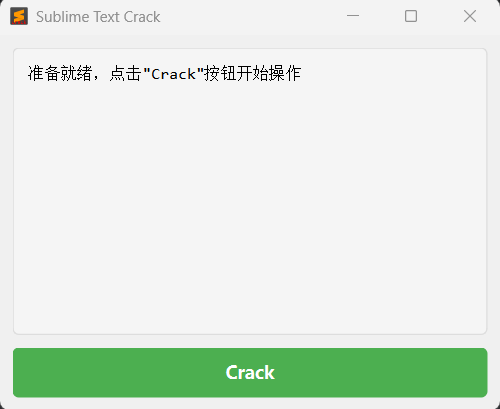

# Sublime-Cracker

一个用于 Sublime Text 的crack程序

## 项目介绍

Sublime-Cracker 是一个基于 PySide6 开发的图形界面工具，旨在为 Sublime 系列软件提供crack功能。本项目使用 Python 3.12 开发，并通过 uv 进行包管理，确保依赖管理的高效性和一致性。



## 环境要求

- Python 3.12 或更高版本
- uv 包管理器

## 项目结构
```text
Sublime-Cracker/
├── crack/                # 破解文件
├── main.py               # 程序入口及破解逻辑
├── main.spec             # pyinstaller打包配置
├── pyproject.toml        # 项目依赖配置（uv）
└── README.md             # 项目说明文档
```
## 使用方法

从relese下载最新版本exe可执行文件，直接运行即可

## 安装步骤

### 1. 安装 Python 3.12

请从 [Python 官方网站](https://www.python.org/downloads/) 下载并安装 Python 3.12 版本，确保勾选"Add Python to PATH"选项。
或者：

```bash
# 使用uv安装python编译器
uv python install 3.12
```

### 2. 安装 uv 包管理器

```bash
# 使用 pip 安装 uv
pip install uv
```

### 3. 克隆项目并安装依赖

```bash
# 克隆仓库
git clone https://github.com/firework-a/Sublime-Cracker.git
cd Sublime-Cracker

# 使用 uv 安装依赖
uv sync
```

### 4. 打包可执行文件（使用nuika打包）

```bash
# 注意目录名不要出现中文，否则打包会失败
python -m nuitka --onefile --windows-console-mode=disable --windows-icon-from-ico="sublime_text.ico" --enable-plugin=pyside6 --follow-import-to=need --output-dir=output main.py
```

## 注意事项
- 本工具仅用于学习和研究目的，请勿用于商业用途
- 使用前请确保你已获得 Sublime 软件的合法使用授权
- 不同版本的 Sublime 可能需要不同的破解策略，如遇问题请尝试更新本工具

## 许可证
本项目采用 MIT 许可证开源，详情请参见 LICENSE 文件。

## 免责声明
本工具仅用于学习和研究 Python 编程及逆向工程技术，使用本工具需遵守当地法律法规。对于因不当使用本工具造成的任何损失或法律责任，由使用者自行承担。